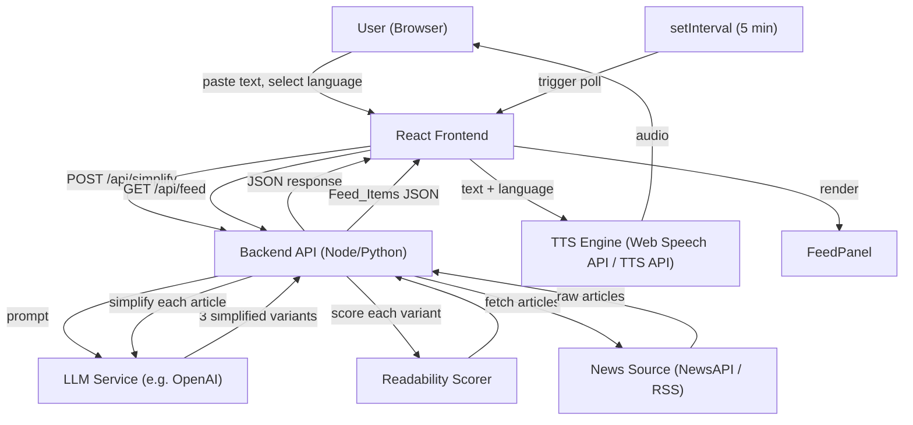

# Design Document: AI Crisis Text Simplifier

## Overview

The AI Crisis Text Simplifier is a web application that transforms emergency alert text into accessible formats for users with low literacy, cognitive disabilities, or limited English proficiency. Users paste raw alert text and receive simplified versions at three reading levels, optional translations into five languages, and audio playback of each variant.

The system is scoped to approximately 10 hours of development and uses a React + Tailwind frontend, a lightweight Node.js or Python backend, an LLM for text simplification and translation, and a TTS API for audio.

### Key Design Decisions

- Single-page app: All interactions happen on one page, no routing needed, keeping scope tight.
- LLM handles both simplification and translation in one pass per language, reducing API calls and latency.
- Client-side TTS via Web Speech API as a zero-cost fallback when a dedicated TTS API is unavailable.
- Readability scoring runs server-side (e.g. textstat in Python or text-readability in Node) so the frontend stays simple.

---

## Architecture



Manual simplification request flow:

1. User pastes alert text and optionally selects a language, then submits.
2. Frontend POSTs `{ text, language }` to `/api/simplify`.
3. Backend sends a structured prompt to the LLM requesting Grade 3, 6, and 9 variants in the target language.
4. Backend scores each variant with Flesch-Kincaid and returns all three with scores.
5. Frontend renders the three cards simultaneously.
6. User can click play on any card; TTS reads the card text aloud in the selected language.
7. Language toggle triggers a new `/api/simplify` call with the new language.

Automated feed flow:

1. On mount, the frontend starts a `setInterval` timer firing every 5 minutes (300,000 ms).
2. Each tick dispatches a `GET /api/feed` request.
3. Backend fetches recent crisis/emergency articles from the news source (NewsAPI or RSS).
4. For each article, the backend calls the LLM to produce three simplified variants and scores them.
5. Backend returns an array of `FeedItem` objects.
6. Frontend prepends new items to the feed list; existing items are preserved.
7. If the request fails, the feed list is unchanged and a non-blocking error banner is shown.
8. When the user changes Reading_Level, all Feed_Items re-render to show the variant for the new level.

---

## Components and Interfaces

### Frontend Components

```
App
├── AlertInputPanel
│   ├── TextArea (with char counter)
│   └── SubmitButton
├── LanguageToggle
├── ReadingLevelSelector
├── OutputPanel
│   └── SimplifiedCard x3 (Grade 3, 6, 9)
│       ├── ReadingLevelBadge
│       ├── OutputText
│       └── AudioControls (PlayButton, StopButton, PlayingIndicator)
├── FeedPanel
│   ├── FeedStatusBar (polling indicator + error banner)
│   └── FeedItem[]
│       ├── ArticleTitle
│       ├── ArticleSource
│       ├── PublishedAt
│       └── SimplifiedText (shows variant for active Reading_Level)
└── StatusRegion (ARIA live region for loading/errors)
```

`FeedPanel` mounts a `setInterval` (5 minutes) on mount and clears it on unmount. It dispatches `GET /api/feed` on each tick and on initial mount. The `activeLevel` prop (from shared state) controls which variant each `FeedItem` renders.

### Backend API

POST /api/simplify

Request:
```json
{
  "text": "string (1-5000 chars)",
  "language": "en | es | fr | zh | ar | pt"
}
```

Response (success):
```json
{
  "variants": [
    { "level": "grade3", "text": "...", "fkScore": 3.2 },
    { "level": "grade6", "text": "...", "fkScore": 5.8 },
    { "level": "grade9", "text": "...", "fkScore": 8.4 }
  ]
}
```

Response (error):
```json
{
  "error": "string",
  "code": "LLM_UNAVAILABLE | TIMEOUT | MALFORMED_RESPONSE | VALIDATION_ERROR"
}
```

### LLM Prompt Template

```
You are an emergency communications assistant. Rewrite the following alert text at three reading levels.
Preserve ALL critical safety information: locations, times, and required actions.
Output language: {language}.

Return a JSON object with exactly this structure:
{
  "grade3": "<rewrite at Grade 3 level>",
  "grade6": "<rewrite at Grade 6 level>",
  "grade9": "<rewrite at Grade 9 level>"
}

Alert text:
{alert_input}
```

### GET /api/feed

Fetches recent crisis and emergency articles from the configured news source, simplifies each one at all three reading levels, and returns an array of `FeedItem` objects.

Query parameters:
- `since` (optional, ISO 8601 timestamp): only return articles published after this time. If omitted, returns the latest batch (up to 20 articles).

Response (success):
```json
{
  "items": [
    {
      "id": "string (unique article identifier)",
      "title": "string",
      "source": "string",
      "publishedAt": "ISO 8601 timestamp",
      "variants": [
        { "level": "grade3", "text": "...", "fkScore": 3.1 },
        { "level": "grade6", "text": "...", "fkScore": 5.9 },
        { "level": "grade9", "text": "...", "fkScore": 8.2 }
      ]
    }
  ],
  "fetchedAt": "ISO 8601 timestamp"
}
```

Response (error):
```json
{
  "error": "string",
  "code": "NEWS_SOURCE_UNAVAILABLE | TIMEOUT | MALFORMED_RESPONSE"
}
```

### News Source Integration

The backend integrates with a public news API to retrieve crisis and emergency articles. The recommended source is [NewsAPI](https://newsapi.org/) using the `/v2/everything` endpoint with a query such as `q=emergency OR crisis OR disaster OR evacuation` filtered to the last 24 hours. An RSS fallback (e.g. FEMA, ReliefWeb) can be used if NewsAPI is unavailable or rate-limited.

Key integration details:
- API key stored in an environment variable (`NEWS_API_KEY`), never committed to source.
- Results are filtered server-side to exclude articles with empty or very short body text (< 50 chars).
- A maximum of 20 articles are processed per polling cycle to bound LLM cost and latency.
- Article deduplication is done by `id` (NewsAPI article URL hash) so re-fetched articles are not re-simplified.

---

## Data Models

### AlertInput
```typescript
interface AlertInput {
  text: string;       // 1-5000 chars
  language: Language; // default: "en"
}
```

### Language
```typescript
type Language = "en" | "es" | "fr" | "zh" | "ar" | "pt";
```

### ReadingLevel
```typescript
type ReadingLevel = "grade3" | "grade6" | "grade9";
```

### SimplifiedVariant
```typescript
interface SimplifiedVariant {
  level: ReadingLevel;
  text: string;
  fkScore: number;
}
```

### SimplifyResponse
```typescript
interface SimplifyResponse {
  variants: SimplifiedVariant[];
}
```

### AppError
```typescript
interface AppError {
  error: string;
  code: "LLM_UNAVAILABLE" | "TIMEOUT" | "MALFORMED_RESPONSE" | "VALIDATION_ERROR";
}
```

### FeedItem
```typescript
interface FeedItem {
  id: string;           // unique article identifier (e.g. URL hash)
  title: string;
  source: string;
  publishedAt: string;  // ISO 8601
  variants: SimplifiedVariant[]; // always grade3, grade6, grade9
}
```

### FeedResponse
```typescript
interface FeedResponse {
  items: FeedItem[];
  fetchedAt: string; // ISO 8601
}
```

### FeedError
```typescript
interface FeedError {
  error: string;
  code: "NEWS_SOURCE_UNAVAILABLE" | "TIMEOUT" | "MALFORMED_RESPONSE";
}
```

### UI State
```typescript
interface AppState {
  inputText: string;
  language: Language;
  activeLevel: ReadingLevel;
  status: "idle" | "loading" | "success" | "error";
  variants: SimplifiedVariant[] | null;
  error: AppError | null;
  playingLevel: ReadingLevel | null;
  feed: {
    items: FeedItem[];
    isPolling: boolean;
    feedError: FeedError | null;
  };
}
```

---

## Correctness Properties

*A property is a characteristic or behavior that should hold true across all valid executions of a system — essentially, a formal statement about what the system should do. Properties serve as the bridge between human-readable specifications and machine-verifiable correctness guarantees.*

### Property 1: Input length validation

*For any* string input, the validation function should accept strings of length 1–5000 and reject strings of length 0 or greater than 5000.

**Validates: Requirements 1.1, 1.3**

### Property 2: Valid input is forwarded to the Simplifier

*For any* non-empty string of 5000 characters or fewer, submitting it should result in the Simplifier being called with that exact string as the alert input.

**Validates: Requirements 1.4**

### Property 3: Response always contains three level variants

*For any* valid alert input, the Simplifier response should contain exactly three variants with levels `grade3`, `grade6`, and `grade9`.

**Validates: Requirements 2.1**

### Property 4: All three variants are rendered simultaneously

*For any* successful Simplifier response, the rendered output panel should display all three reading-level variants at the same time.

**Validates: Requirements 2.2**

### Property 5: FK score bounds per reading level

*For any* valid alert input, the returned variants should satisfy: `grade3.fkScore <= 4.0`, `4.1 <= grade6.fkScore <= 7.0`, and `7.1 <= grade9.fkScore <= 10.0`.

**Validates: Requirements 2.5, 2.6, 2.7**

### Property 6: Language selection updates all displayed variants

*For any* language selection from the Language_Toggle, all three displayed Simplified_Output variants should be in the selected language, and this update should occur without requiring a new manual submission.

**Validates: Requirements 3.2, 3.4**

### Property 7: Each output card has a play button

*For any* rendered set of Simplified_Output variants, each card should contain a play button control.

**Validates: Requirements 4.1**

### Property 8: TTS is called with correct text and language

*For any* play button activation on a given card and any currently selected language, the TTS engine should be invoked with the text of that specific card and the currently selected language.

**Validates: Requirements 4.2, 4.6**

### Property 9: Playing indicator is shown during active playback

*For any* app state where `playingLevel` is non-null, the card corresponding to that level should display a visual playing indicator.

**Validates: Requirements 4.3**

### Property 10: Stop control halts TTS

*For any* active playback state, activating the stop control should result in TTS stop being called and `playingLevel` being set to null.

**Validates: Requirements 4.4**

### Property 11: ARIA labels on all interactive controls

*For any* rendered state of the app, all interactive controls (submit button, language toggle, play buttons, stop buttons) should have non-empty `aria-label` attributes.

**Validates: Requirements 5.3**

### Property 12: ARIA live region reflects loading and success states

*For any* app state transition to `loading` or `success`, the ARIA live region should contain a non-empty announcement string reflecting that state.

**Validates: Requirements 5.5, 5.6**

### Property 13: Alert input is preserved on any error

*For any* error condition (LLM unavailable, timeout, malformed response), the `inputText` in app state should remain unchanged from what the user entered before the request.

**Validates: Requirements 6.3**

### Property 14: Feed polling fires on the correct interval

*For any* number of elapsed 5-minute intervals, the feed polling function should have been called exactly that many times (plus the initial mount call).

**Validates: Requirements 7.1**

### Property 15: Each retrieved article is passed to the Simplifier

*For any* batch of articles returned by the news source, the Simplifier should be called exactly once per article, with that article's text as input.

**Validates: Requirements 7.2**

### Property 16: Feed_Items display the active Reading_Level variant

*For any* feed state containing Feed_Items and any active Reading_Level, every rendered Feed_Item should display the Simplified_Output variant corresponding to that Reading_Level — both on initial render and after the user changes the level.

**Validates: Requirements 7.3, 7.7**

### Property 17: New Feed_Items are prepended without removing existing items

*For any* existing feed list of length N and any new batch of M articles, after a successful polling cycle the feed list should have length N + M and the M new items should appear before the original N items.

**Validates: Requirements 7.4**

### Property 18: Polling indicator is shown during active poll

*For any* feed state where `isPolling` is `true`, the rendered FeedPanel should contain a visible polling/refresh indicator element.

**Validates: Requirements 7.5**

### Property 19: Feed items are preserved on polling failure

*For any* existing feed state and any polling request failure, the feed item list should be identical to the pre-failure list and a non-blocking error message should be visible in the UI.

**Validates: Requirements 7.6**

### Property 20: Feed_Item FK scores satisfy reading level bounds

*For any* Feed_Item produced by the feed pipeline, its three variants should satisfy the same Flesch-Kincaid bounds: `grade3.fkScore <= 4.0`, `4.1 <= grade6.fkScore <= 7.0`, and `7.1 <= grade9.fkScore <= 10.0`.

**Validates: Requirements 7.8**

---

## Error Handling

### Input Validation Errors (client-side)
- Empty input: show inline message "Please enter alert text." Focus remains on textarea.
- Over 5000 chars: show inline character count message "Text exceeds 5,000 character limit." Submit button is disabled.

### API / Network Errors

| Error Code | User-Facing Message | UI Action |
|---|---|---|
| LLM_UNAVAILABLE | "The simplification service is currently unavailable. Please try again." | Show retry button |
| TIMEOUT | "The request timed out. Please try again." | Show retry button |
| MALFORMED_RESPONSE | "Something went wrong. Please try again." | Show retry button; log details to console |
| VALIDATION_ERROR | "Invalid input. Please check your text and try again." | Highlight input field |

### TTS Errors
- If TTS fails: show inline message on the affected card: "Audio unavailable for this variant."
- If Web Speech API is not available in the browser, the play button is hidden and a static note is shown.

### Timeout Handling
- Frontend sets a 15-second AbortController timeout on the fetch call.
- On abort, dispatch TIMEOUT error and preserve inputText.

### Error State Preservation
- On any error, inputText is never cleared.
- Previously successful variants are retained in state so the user can still see prior output.

### Feed Errors

| Error Code | User-Facing Message | UI Action |
|---|---|---|
| NEWS_SOURCE_UNAVAILABLE | "Could not refresh the feed. Will retry in 5 minutes." | Non-blocking banner; existing items retained |
| TIMEOUT | "Feed refresh timed out. Will retry in 5 minutes." | Non-blocking banner; existing items retained |
| MALFORMED_RESPONSE | "Feed refresh failed. Will retry in 5 minutes." | Non-blocking banner; log details to console |

Feed error handling rules:
- Feed errors are always non-blocking: they never replace or clear existing Feed_Items.
- The error banner auto-dismisses after 10 seconds or when the next successful poll completes.
- The polling interval continues regardless of errors; the next tick will attempt another fetch.

---

## Testing Strategy

### Dual Testing Approach

Both unit tests and property-based tests are required. They are complementary:
- Unit tests catch concrete bugs at specific examples and integration points.
- Property tests verify universal correctness across a wide range of generated inputs.

### Unit Tests

Focus on:
- Specific examples: submitting a known alert text and asserting the rendered output structure.
- Error path examples: LLM unavailable response renders retry button; timeout clears loading state; malformed response shows generic message; TTS failure shows audio unavailable message.
- Integration: language toggle change triggers a new API call with the correct language parameter.
- Edge cases: empty string submission, exactly 5000 chars (accepted), 5001 chars (rejected).
- Feed examples: initial mount triggers a feed poll; successful poll prepends items; failed poll shows non-blocking banner without clearing items; reading level change re-renders all Feed_Items.

### Property-Based Tests

Use a property-based testing library appropriate to the language:
- Frontend (TypeScript/React): fast-check
- Backend (Python): Hypothesis
- Backend (Node): fast-check

Each property test must run a minimum of 100 iterations.

Each test must include a comment tag in the format:
`// Feature: crisis-text-simplifier, Property {N}: {property_text}`

Property test mapping:

| Property | Test Description |
|---|---|
| P1 | Generate strings of random length; assert accept/reject based on length bounds |
| P2 | Generate valid strings; assert simplifier mock called with exact input |
| P3 | Generate valid inputs; assert response has exactly 3 variants with correct level keys |
| P4 | Generate valid responses; assert all 3 cards rendered in output panel |
| P5 | Generate valid inputs; assert each variant's fkScore is within its specified range |
| P6 | Generate language selections; assert all rendered cards reflect selected language |
| P7 | Generate valid responses; assert each card contains a play button element |
| P8 | Generate card selections and language choices; assert TTS mock called with correct text and language |
| P9 | Generate playingLevel values; assert correct card shows playing indicator |
| P10 | Generate active playback states; assert stop sets playingLevel to null and calls TTS stop |
| P11 | Generate app states; assert all interactive controls have non-empty aria-label |
| P12 | Generate loading/success state transitions; assert ARIA live region is non-empty |
| P13 | Generate error conditions; assert inputText unchanged after error |
| P14 | Generate elapsed time intervals; assert poll function call count matches interval count |
| P15 | Generate article batches; assert Simplifier called once per article with correct text |
| P16 | Generate feed states and reading levels; assert each Feed_Item renders the correct variant |
| P17 | Generate existing feed lists and new article batches; assert prepend preserves all items in correct order |
| P18 | Generate feed states with isPolling=true; assert polling indicator is present in rendered output |
| P19 | Generate feed states and polling failures; assert feed items unchanged and error banner visible |
| P20 | Generate Feed_Items via feed pipeline; assert all variant fkScores satisfy level-specific bounds |

### Test File Structure

```
src/
  __tests__/
    unit/
      validation.test.ts
      simplifier.test.ts
      rendering.test.ts
      tts.test.ts
      errorHandling.test.ts
      feed.test.ts
    property/
      validation.prop.test.ts
      simplifier.prop.test.ts
      rendering.prop.test.ts
      tts.prop.test.ts
      errorHandling.prop.test.ts
      feed.prop.test.ts
```
